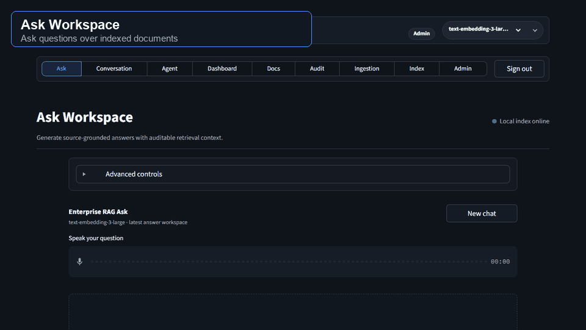

# Local RAG Application

A modular Retrieval-Augmented Generation application in Python. It accepts PDF,
TXT, DOCX, and image uploads, extracts text and visual descriptions, chunks by
token count, creates OpenAI embeddings, stores vectors locally in FAISS, and
answers questions using retrieved context.

## Live App

Access the deployed Streamlit Community Cloud app here:

```text
https://enterprise-rag-vbhjbfxe6xrewsvnudhuoi.streamlit.app/
```

## Walkthrough



## Architecture


The local knowledge index is stored under `data/index/<embedding-model>/`.
FAISS keeps the numerical vectors in `index.faiss`, while `chunks.json` and
`documents.json` keep the source text and metadata needed for citations.

## Project Structure

```text
.
|-- api.py
|-- config.py
|-- errors.py
|-- audio_io.py
|-- ingestion.py
|-- openai_client.py
|-- rag_pipeline.py
|-- retriever.py
|-- streamlit_app.py
|-- usage_store.py
|-- vector_store.py
|-- docs/assets/          # README walkthrough media
|-- requirements.txt
|-- .streamlit/config.toml
`-- data/                 # Created at runtime; ignored by git
```

## Setup

Python 3.10+ is required.

```powershell
python -m venv .venv
.\.venv\Scripts\Activate.ps1
pip install -r requirements.txt
```

Optional packages:

```powershell
pip install truststore
```

`truststore` improves `OPENAI_SSL_MODE=system` on Windows corporate laptops.
`PyMuPDF` is included in `requirements.txt` so PDF ingestion and source previews
can render full pages for richer visual understanding.

Set your OpenAI key. The app reads it with `os.getenv("OPENAI_API_KEY")`.

```powershell
$env:OPENAI_API_KEY="your-api-key"
```

For CMD:

```cmd
set OPENAI_API_KEY=your-api-key
```

## Run The UI

```powershell
streamlit run streamlit_app.py
```

The UI opens at:

```text
http://localhost:8501
```

The enterprise UI is organized into:

- `Dashboard`: index readiness, document volume, session activity, governance markers.
- `Ask`: streaming source-grounded answers with text or voice input, spoken answers, hybrid search, source filters, feedback buttons, source previews, chat model, knowledge index, Top K, and similarity threshold controls.
- `Conversation`: streaming multi-turn RAG chat with text or voice turns, retained context, citations, spoken answers, source filters, feedback buttons, and Markdown/JSON export.
- `Ingestion`: multi-file and folder upload with embedding model, vision model, chunking controls, queued/indexing/completed/failed statuses, and retry.
- `Retrieval Audit`: semantic-search inspection before answer generation.
- `Documents`: filterable inventory with CSV export.
- `Index Management`: delete, re-index, rebuild, reset, and migrate documents across embedding indexes.
- `Administration`: runtime settings, storage paths, upload limits, usage/cost tracking, feedback export, and connection diagnostics.

The app opens to a login screen before the dashboard. Built-in local users are
`admin/admin` and `user/user`. `Admin` can ingest documents, change models,
manage indexes, and run admin diagnostics. `User` can ask questions, use
conversation mode, audit retrieval, and view documents.

Voice input and output are available to both roles. Pick `Auto`, `English`, or
`Hindi` from the Voice controls for demo use. `Auto` detects the spoken question
language, and answers are prompted to remain in that user language.

Ask and Conversation support `Hybrid`, `Semantic`, and `Keyword` retrieval
modes. Hybrid search combines FAISS semantic matches with a local BM25-style
keyword scorer, which improves exact IDs, dates, policy names, and filenames.
Source filters can restrict retrieval by document, file type, source type,
upload date, folder/path text, or metadata/tag text.

Answer feedback is stored locally in `data/feedback.jsonl`. Admins can review
recent feedback and export JSONL or CSV from Administration.

Usage events are stored locally in `data/usage.jsonl`. Admins can review calls,
tokens, audio/image units, and document-linked usage from Administration, then
export JSONL or CSV for approved cost reporting.

The Upload tab supports:

- Multiple file upload, up to `MAX_UPLOAD_FILES` documents per batch.
- Folder upload, including supported files in subdirectories.
- PDF, TXT, DOCX, PNG, JPG, JPEG, WEBP, and GIF.
- Visual understanding for PDF pages with images, DOCX embedded images, and standalone image uploads.
- A processing queue with retry for failed files.
- A clean completion message instead of raw hash/vector metadata.

Streamlit's upload limit is configured in `.streamlit/config.toml`:

```toml
[server]
maxUploadSize = 4096
```

## Run The API

```powershell
uvicorn api:app --reload --host 127.0.0.1 --port 8000
```

Open the interactive API docs:

```text
http://127.0.0.1:8000/docs
```

## Upload One Document

```powershell
curl.exe -X POST "http://127.0.0.1:8000/upload" `
  -F "file=@C:\path\to\document.pdf" `
  -F "vision_model=gpt-4.1-mini" `
  -F "vision_enabled=true" `
  -F "vision_detail=high" `
  -F "chunk_size_tokens=500" `
  -F "chunk_overlap_tokens=50"
```

## Upload Multiple Documents

```powershell
curl.exe -X POST "http://127.0.0.1:8000/upload/batch" `
  -F "files=@C:\path\to\document1.pdf" `
  -F "files=@C:\path\to\document2.docx" `
  -F "files=@C:\path\to\diagram.png" `
  -F "vision_enabled=true" `
  -F "chunk_size_tokens=500" `
  -F "chunk_overlap_tokens=50"
```

Response:

```json
{
  "message": "Indexing completed.",
  "files_processed": 2,
  "chunks_added": 104,
  "duplicates_skipped": 0,
  "results": []
}
```

Repeated uploads of the same file are skipped using a SHA-256 file hash, so
embeddings are not recomputed unnecessarily.

## Ask A Question

```powershell
curl.exe -X POST "http://127.0.0.1:8000/ask" `
  -H "Content-Type: application/json" `
  -d "{\"query\":\"What are the payment terms?\",\"top_k\":5,\"min_score\":0.2,\"model\":\"gpt-5.2\",\"embedding_model\":\"text-embedding-3-large\",\"response_language\":\"English\",\"search_mode\":\"hybrid\",\"filters\":{\"file_types\":[\"pdf\"]}}"
```

Response:

```json
{
  "answer": "The payment terms are ...",
  "sources": ["retrieved chunk 1", "retrieved chunk 2"],
  "source_metadata": [
    {
      "file_name": "document.pdf",
      "page_number": 3,
      "source_type": "image",
      "image_index": 1,
      "chunk_index": 4,
      "score": 0.87
    }
  ],
  "confidence": 0.87
}
```

The prompt used for answer generation is:

```text
You are a helpful assistant.
Answer ONLY from the provided context.
If answer is not in context, say "I don't know".

Context:
{context}

Question:
{question}
```

## Configuration

All values are environment-driven. Common settings:

| Variable | Default | Description |
| --- | --- | --- |
| `OPENAI_API_KEY` | none | Required OpenAI API key |
| `OPENAI_EMBEDDING_MODEL` | `text-embedding-3-large` | Embedding model |
| `OPENAI_CHAT_MODEL` | `gpt-5.2` | Chat Completions model |
| `OPENAI_VISION_MODEL` | `gpt-4.1-mini` | Vision model used during image-aware ingestion |
| `OPENAI_TRANSCRIPTION_MODEL` | `gpt-4o-mini-transcribe` | Speech-to-text model for voice questions |
| `OPENAI_TTS_MODEL` | `gpt-4o-mini-tts` | Text-to-speech model for spoken answers |
| `OPENAI_TTS_VOICE` | `marin` | Default spoken answer voice |
| `OPENAI_TEMPERATURE` | `0` | Chat sampling temperature; set to `none` to omit |
| `OPENAI_SSL_MODE` | `system` | SSL mode: `system`, `custom`, `certifi`, or `insecure` |
| `CHUNK_SIZE_TOKENS` | `500` | Chunk size |
| `CHUNK_OVERLAP_TOKENS` | `50` | Chunk overlap |
| `TOP_K` | `5` | Retrieved chunks per query |
| `MAX_ANSWER_TOKENS` | `800` | Chat answer token limit |
| `HYBRID_SEMANTIC_WEIGHT` | `0.7` | Weight for semantic score in hybrid retrieval |
| `MAX_UPLOAD_FILES` | `20` | Maximum files per upload batch |
| `MAX_UPLOAD_SIZE_MB` | `4096` | Per-file upload limit |
| `VISION_INGESTION_ENABLED` | `true` | Describe images during ingestion |
| `VISION_DETAIL` | `high` | Vision detail level: `low`, `high`, or `auto` |
| `MAX_VISUAL_PAGES` | `80` | Maximum PDF pages rendered for visual understanding per document |
| `MAX_DOCX_IMAGES` | `80` | Maximum DOCX embedded images described per document |
| `MAX_IMAGE_DIMENSION_PX` | `1600` | Maximum image dimension sent to the vision model |
| `VOICE_OUTPUT_ENABLED` | `true` | Enable spoken answers by default |
| `VOICE_LANGUAGE` | `Auto` | Default voice language mode |
| `RAG_DATA_DIR` | `data` | Local upload/index storage |
| `RAG_FEEDBACK_PATH` | `data/feedback.jsonl` | Local answer feedback store |
| `RAG_USAGE_PATH` | `data/usage.jsonl` | Local usage and cost-tracking event store |
| `RAG_AUTH_ENABLED` | `true` | Enable password-gated local roles |
| `RAG_DEFAULT_ROLE` | `User` | Default role when auth is disabled |
| `RAG_ADMIN_USERNAME` | `admin` | Admin username |
| `RAG_ADMIN_PASSWORD` | `admin` | Admin password |
| `RAG_USER_USERNAME` | `user` | User username |
| `RAG_USER_PASSWORD` | `user` | User password |

Indexes are model-specific by default. For example, `text-embedding-3-large`
uses `data/index/text-embedding-3-large/`, so vectors from different embedding
models are not mixed in one FAISS index.

The UI includes curated chat model options for GPT-5 and GPT-4 families, plus
separate embedding and vision model selectors. The Ingestion and Retrieval
Audit screens include embedding model selectors; when you switch embedding
models, you are switching to that model's separate FAISS index.

## API RBAC Headers

Upload and batch upload endpoints require Admin role. With default local
settings, send:

```powershell
-H "X-RAG-Admin-Key: admin"
```

If you disable auth and want to simulate Admin role, send:

```powershell
-H "X-RAG-Role: admin"
```

Non-admin API callers cannot override `model` or `embedding_model` on `/ask`.

## SSL And Corporate Network Fallbacks

The OpenAI client is created with `httpx` and `trust_env=True`, so standard
proxy variables such as `HTTPS_PROXY` and `HTTP_PROXY` are respected.

By default, `OPENAI_SSL_MODE=system` uses the operating system trust store
through `truststore`. This is usually the best setting on corporate Windows
laptops because your company's root certificate is often installed in Windows,
not in Python's certifi bundle.

In the Streamlit UI, use the sidebar **Test OpenAI connection** button before
uploading large files. It makes a tiny embeddings request and reports the
certificate/proxy failure details.

Preferred corporate setup:

```powershell
$env:OPENAI_SSL_MODE="system"
```

If the company provides a CA bundle file:

```powershell
$env:OPENAI_SSL_MODE="custom"
$env:OPENAI_CA_BUNDLE="C:\path\to\company-ca-bundle.pem"
```

If your environment needs an outbound proxy:

```powershell
$env:HTTPS_PROXY="http://proxy.company.com:8080"
$env:HTTP_PROXY="http://proxy.company.com:8080"
```

If your environment requires disabling verification temporarily:

```powershell
$env:OPENAI_SSL_MODE="insecure"
$env:DISABLE_SSL_WARNINGS="true"
```

Use insecure mode only when permitted by your organization.

## Notes

- FAISS uses normalized vectors with `IndexFlatIP`, which gives cosine
  similarity.
- PDF parsing uses `pdfplumber` first and falls back to `pypdf`; image-aware
  ingestion extracts embedded images through `pypdf`, and renders full visual
  pages automatically when optional `PyMuPDF` is installed.
- DOCX parsing includes paragraphs, table text, and embedded images.
- Standalone image uploads are converted into searchable visual descriptions.
- Metadata includes file name, page number when available, chunk index, token
  offsets, vector position, source type, image index, and embedding model.

## Troubleshooting

If `pip install faiss-cpu` fails on Windows, install FAISS through Conda:

```powershell
conda install -c pytorch faiss-cpu
```

Then install the remaining packages:

```powershell
pip install -r requirements.txt
```
